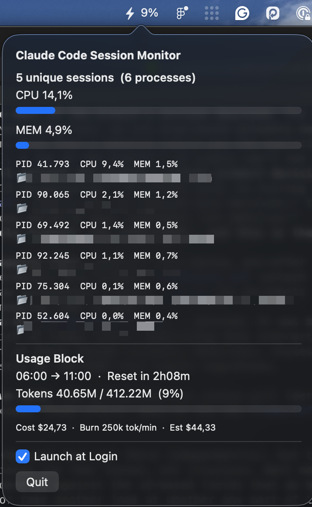
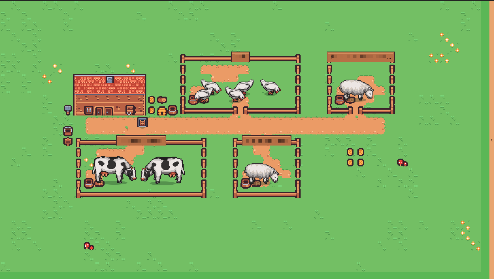
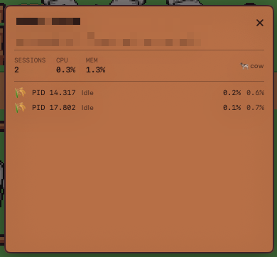
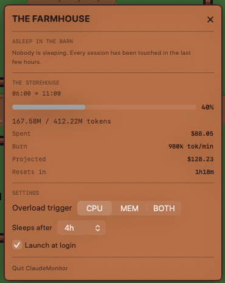

# ClaudeMonitor

A native macOS app for watching your Claude Code sessions, with two ways to look at them:

- a **menu bar dropdown** — running processes (CPU/MEM/working directory) and your current usage block (tokens, cost, burn rate) via [ccusage](https://github.com/ryoppippi/ccusage), live, with no terminal window open
- a **pixel-art farm** — every project is a pen, every session is an animal, and what the animal is doing tells you what the session is doing

Built with SwiftUI + Swift Package Manager, no Xcode project required.

<p align="center">
  
</p>

## Requirements

- macOS 13.0 (Ventura) or later
- [Xcode Command Line Tools](https://developer.apple.com/xcode/resources/) (`xcode-select --install`) — free, no Apple Developer account needed
- Node.js with `npx` on your `PATH` if you want anything cost- or token-related populated (it shells out to `npx ccusage`). The app works fine without it: the usage section shows "unavailable" and the farm simply draws no feed gauge

## Install

### Option A: Build from source (recommended — no security warnings)

```bash
git clone https://github.com/sr-albert/watchagents.git
cd watchagents
./Scripts/build-app.sh
open ~/Applications/ClaudeMonitor.app
```

Since you're building the app yourself, macOS never flags it as downloaded-from-the-internet, so there's no Gatekeeper warning.

### Option B: Pre-built release

Download the zipped app from the [Releases](https://github.com/sr-albert/watchagents/releases) page, then:

```bash
unzip ClaudeMonitor.zip -d ~/Applications
```

The app isn't notarized (that requires a paid Apple Developer account), so the first time you open it macOS will warn that it's from an "unidentified developer." To open it anyway:

- Right-click (or Control-click) `ClaudeMonitor.app` in Finder → **Open** → confirm **Open** in the dialog, **or**
- Run `xattr -cr ~/Applications/ClaudeMonitor.app` in Terminal to clear the quarantine flag, then open normally.

You only need to do this once.

## Usage

Launch the app and look for the bolt icon in your menu bar — it shows your current usage-block token percentage next to it. Click it to see:

- Your active Claude Code sessions (PID, CPU%, MEM%, working directory)
- Total CPU/MEM usage across sessions
- The current usage block: tokens used/remaining, cost, burn rate, and time until reset
- **Open Farm 🌾** — opens the farm window described below
- A **Launch at Login** toggle
- **Quit**

## The Farm

A wall of session text tells you how many sessions you have. It doesn't tell you which one
is stuck. The farm is the same data arranged so that the answer is a glance instead of a
read: **one pen per project, one animal per process.**

<p align="center">
  
</p>

Open it from **Open Farm 🌾** in the dropdown. The scene picks an integer pixel scale — 3×,
2×, or 1× — to fit whatever size you drag the window to, so the art never blurs. Below the
size where even 1× fits, it scrolls rather than clip a pen.

### Who's who

Each project gets a cow, a pig, a sheep, or a chicken, chosen by a stable hash of its
path. The hash is FNV-1a rather than Swift's built-in one, which reseeds every launch —
so your project keeps the same animal tomorrow, and pen size follows the species'
footprint. Two sessions in one project means two animals sharing a pen.

### What the animals are telling you

| the animal is | the session is | how to read it |
|---|---|---|
| head down at the trough | **idle** | under 3% CPU, with the occasional short wander |
| walking the pen | **active** | doing work |
| flashing red, with a bomb | **overloaded** | over your CPU/MEM trigger for 10s straight |
| standing perfectly still, cool-shaded | **frozen** | idle for 10 minutes |
| gone — walked out through the gate | **dormant** | frozen *and* the terminal untouched for hours; it's asleep in the barn |

Stillness is the point of the frozen treatment: in a farm where everything else moves, the
animal that doesn't is the one you were looking for.

### Poking at things

<p align="center">
  
</p>

- **Hover an animal** for a card telling you which session it is; **click** to pin the card
  so it stays up while you look elsewhere.
- **Click a pen's fence or sign** for the project: its sessions, total CPU/MEM, and every
  PID with its own state.
- **The chevron tab** on the right edge opens a panel with every pen at once plus the usage
  block — the whole farm as a list, when you want the numbers.

### The farmhouse

<p align="center">
  
</p>

Click the farmhouse and it opens up:

- **Asleep in the barn** — the dormant sessions, which is where yesterday's leftovers end up
- **The storehouse** — the current usage block in full: tokens, spend, burn rate, projected
  cost, time to reset
- **Settings** — whether the overload trigger watches CPU, MEM, or either; how long a
  terminal sits untouched before its session is bedded down; and the block budget the feed
  gauge measures against

### The feed gauge

Beside the barn, at its right shoulder, a **stack of up to three straw bales** and a
**vat** report the current block. Bales are budget *left* — they come down off the top as
you spend. The vat is money *gone* — it fills as you spend.

> Don't confuse the gauge with the tidy 2×2 hay yard out on the lawn. That's scenery, and
> it uses the same sprite. The gauge is the vertical stack next to the vat.

They're deliberately read against different ceilings — tokens for the bales, dollars for
the vat — because the two are reported independently, and the *gap* between them is the
useful signal: bales down faster than the vat fills means cheap tokens, the vat outrunning
the bales means expensive ones or poor cache hits.

Both ceilings seed themselves, once, from the heaviest block `ccusage` has on record, and
then hold still — a ceiling that drifted upward with every new record would refill the
bales just as you were overspending. Until they're seeded, and whenever `ccusage` isn't
available, **no gauge is drawn at all**: nothing to tell you is not the same claim as
nothing left. Set them yourself under **Block budget** and **Block cost** in the
farmhouse.

### Going deeper

`docs/farm-design-spec.md` is the source of truth for the scene — layout algorithm, exact
state values, and a section on what was tried and rejected.

## Development

```bash
swift build      # debug build
swift test        # run the test suite
swift run         # run without packaging into an .app (menu bar icon still appears)
```

See `Scripts/build-app.sh` for how the release `.app` bundle is assembled (ad-hoc code signed, `LSUIElement` set so there's no Dock icon).

## License

MIT — see [LICENSE](LICENSE).

The bundled pixel art and font are third-party assets under their own licences
(Kenney CC0, LPC farm animals CC-BY 3.0 by Daniel Eddeland, Silkscreen OFL) — see
[THIRD-PARTY-NOTICES.md](THIRD-PARTY-NOTICES.md).
